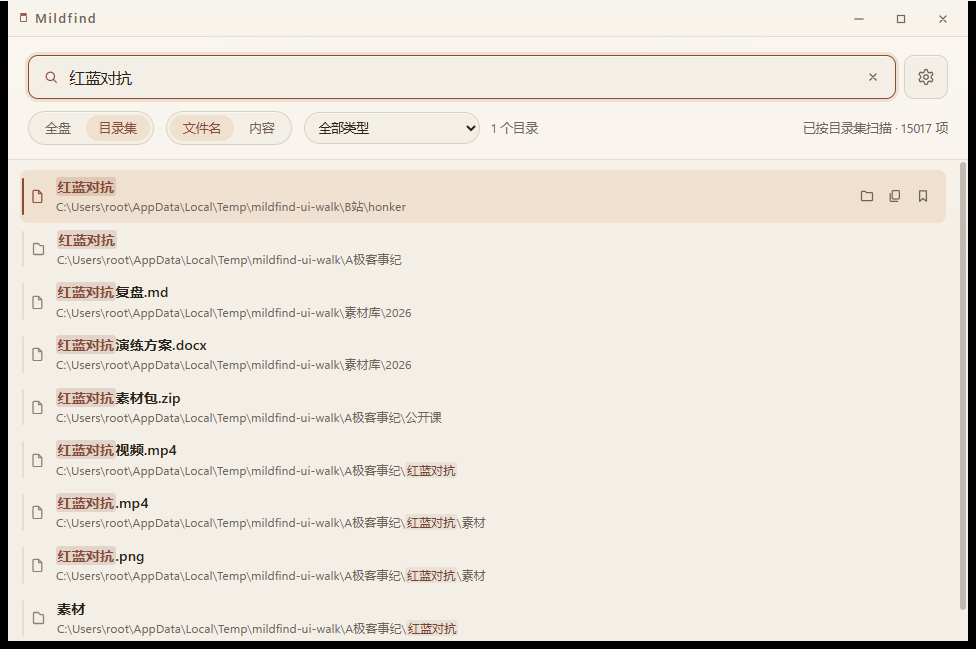
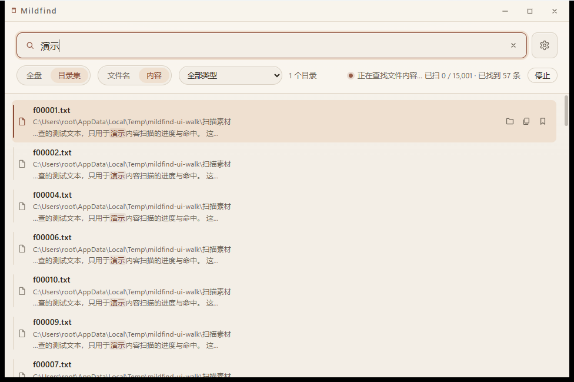
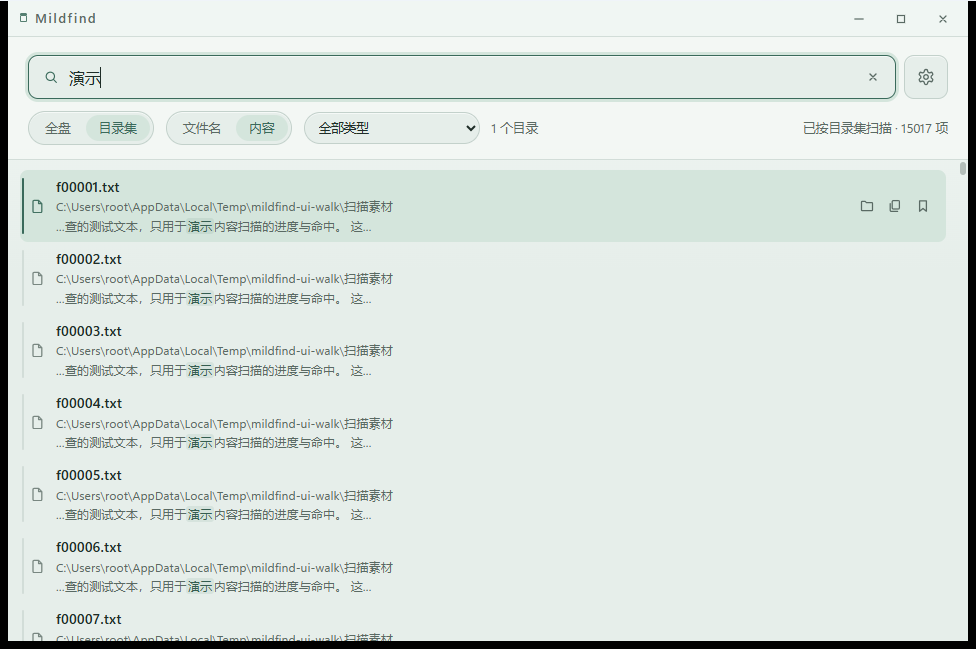
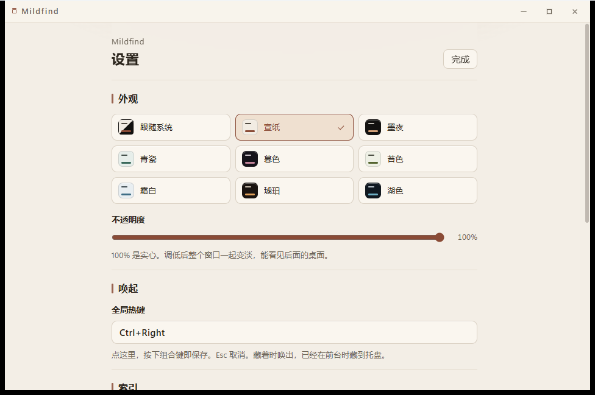

# Mildfind

**轻量、快速的 Windows 本地文件搜索**

全盘 NTFS 秒级索引 · 文件名 / 内容双模式搜索 · 9 套外观

[下载最新版](https://github.com/YottaMeta/Mildfind/releases/latest) ·
[问题反馈](https://github.com/YottaMeta/Mildfind/issues)

---

Mildfind 是一个面向 Windows 的本地文件搜索工具：把文件索引建立在本地，输入关键词即出结果。
不联网、不注册、不上传任何数据，专注于把「找到文件」这一件事做得安静、快速、顺手。

> 本仓库仅用于发布与说明：Mildfind 是**闭源免费软件**，源代码不公开。

## 亮点

- **全盘索引，秒级可用**：直接读取 NTFS 主文件表（MFT）建立索引，配合 USN 变更日志增量更新；
  快照落盘后二次启动即可搜索（本机约 630 万文件、3 卷实测约 2.5 秒）。
- **文件名 + 内容双模式**：文件名搜索即时响应；内容搜索边扫边出结果，带实时进度，
  随时可停，停止后已找到的结果保留。
- **两种索引范围**：全盘（需管理员）或自定义「目录集」（无需管理员，可添加多个目录）。
- **把细节做顺手**：命中高亮、父目录路径、右键菜单（打开 / 打开所在文件夹 / 复制路径 / 钉住）、
  复制反馈、常搜 / 最近 / 历史、托盘常驻、全局热键。
- **9 套外观 + 窗口不透明度**：跟随系统 / 宣纸 / 墨夜 / 青瓷 / 暮色 / 苔色 / 霜白 / 琥珀 / 湖色；
  窗口不透明度 40%–100% 可调。
- **完全本地**：无联网、无账号、无遥测；索引与设置全部保存在你自己的机器上。

## 截图

| 文件名搜索（霜白） | 内容搜索：流式结果 + 进度 + 可停止 |
| --- | --- |
|  |  |

| 湖色外观 | 设置页：9 套外观 / 不透明度 / 全局热键 |
| --- | --- |
|  |  |

## 功能详解

### 索引

- **全盘模式**：读取 NTFS 主文件表（MFT）建立全盘索引，并用 USN 变更日志做增量更新——
  只读访问，不改动文件系统。索引以快照文件保存在本地，之后启动直接恢复快照，无需重建。
  - 全盘模式需要管理员权限（读取 MFT / USN 所需）；在「设置」中勾选「以管理员身份启动」后重启即可。
  - 全盘模式支持 NTFS 卷；索引保存文件名、位置等元数据，以及内容搜索用的特征索引
    （由文本内容生成，不含原文），全部只在本机，不上传。
- **目录集模式**：选择任意文件夹建立索引，无需管理员权限，适用于非 NTFS 或只需搜部分目录的场景；
  使用期间新增的文件会自动进入索引。
- 索引快照大小取决于文件数量（本机约 630 万文件 ≈ 306MB）。

### 搜索

- **文件名搜索**：输入即搜，匹配文件名与上一级目录名，结果按匹配质量与路径长度排序。
- **内容搜索**：对文本类文件（.txt / .md / 代码 / 配置等常见文本格式）搜索文件内容：
  - 边扫描边推送结果，状态栏实时显示「已扫 x / y · 已找到 n 条」；
  - 随时点「停止」或按 Esc，已找到的结果保留；
  - 单文件大小上限 1.5MB，二进制文件自动跳过；
  - 本机实测：全盘内容搜索首条命中约 1.3 秒（视命中位置而定）。
- **类型筛选**：内置常用类型分组；也可在关键词中直接写扩展名（如 `.pdf`）。

### 结果与操作

- 命中处高亮（文件名 / 路径 / 内容片段）；
- 每行提供「打开所在文件夹 / 复制路径 / 钉住」快捷按钮；
- 右键菜单：打开、打开所在文件夹、复制路径、钉住；
- 复制路径后有小提示反馈；
- 「常搜 / 最近打开」管理常用与历史记录（可钉住、可删除）。

### 外观与窗口

- 9 套外观：跟随系统、宣纸、墨夜、青瓷、暮色、苔色、霜白、琥珀、湖色；
- 窗口不透明度 40%–100%（默认实心）；
- 无边框自绘标题栏：拖拽移动、双击最大化、关闭到托盘；
- 托盘：左键唤出窗口，右键退出；
- 全局热键：默认 `Ctrl+Shift+F`；在设置里点一下热键框、按下组合键即保存。

## 安装

### 系统要求

- Windows 10 1809 及以上 / Windows 11（x64）
- Microsoft Edge WebView2 运行时（Windows 11 自带；Windows 10 一般已随 Edge 安装，缺失时可从微软官网获取）
- 全盘索引需要管理员权限；目录集模式不需要

### 下载与安装

1. 在 [Releases](https://github.com/YottaMeta/Mildfind/releases/latest) 页面下载最新的
   `Mildfind_x.y.z_x64-setup.exe`；
2. 双击安装（安装到当前用户目录，不需要管理员）；
3. 首次运行如出现 Windows SmartScreen 提示（未签名应用），点「更多信息 → 仍要运行」即可。

### 卸载

在「设置 → 应用 → 已安装的应用」中找到 Mildfind 卸载，或运行安装目录下的 `uninstall.exe`。

设置与索引数据位于用户目录；如需彻底清理，可删除：

- `%AppData%\Mildfind`（设置、钉住、历史）
- `%LocalAppData%\Mildfind`（索引快照）

## 快速上手

1. **想搜全盘**：打开「设置」→ 勾选「以管理员身份启动」→ 按提示重启（UAC）→ 等待首次索引完成；
2. **不想给管理员权限**：切到「目录集」，添加要搜索的文件夹，几秒内即可开始搜索；
3. 在搜索框输入关键词；点「内容」切换为内容搜索；
4. 结果行右侧可直接操作，右键有更多菜单；
5. 关闭窗口 = 收进托盘；按 `Ctrl+Shift+F`（可改）随时唤出。

## 常见问题

**Q：为什么全盘搜索需要管理员权限？**
A：全盘索引直接读取 NTFS 主文件表（MFT）与 USN 变更日志，这需要管理员权限。
目录集模式完全不需要管理员。

**Q：索引数据存在哪？会占多少空间？**
A：设置与历史在 `%AppData%\Mildfind`；索引快照在 `%LocalAppData%\Mildfind\index.bin`。
本机约 630 万文件时，快照约 306MB。

**Q：内存占用多少？**
A：本机（约 630 万文件）实测常驻约 0.9–1GB；目录集模式按所选目录规模等比缩小。

**Q：内容搜索支持哪些文件？**
A：常见文本类格式（.txt / .md / 代码 / 配置等）；单文件上限 1.5MB，二进制文件自动跳过。

**Q：杀毒软件 / 系统提示风险？**
A：安装包未做代码签名，Windows SmartScreen 可能提示「未知发布者」——这是未签名应用的常规提示。

**Q：怎么更新？**
A：目前为手动更新：下载新版安装包直接覆盖安装，设置与索引都会保留。

**Q：会上传我的数据吗？**
A：不会。Mildfind 不联网、无账号、无遥测，索引与搜索全部在本机完成。

## 版本

- **v0.1.0**（首发）：全盘 MFT 索引 + 目录集索引、文件名 / 内容双模式搜索、9 套外观、
  窗口不透明度、托盘与全局热键、命中高亮与右键菜单。详见 [CHANGELOG.md](CHANGELOG.md)。

## 关于秭元

Mildfind 是秭元（YottaMeta）旗下「元软件」系列产品。

- 秭元（YottaMeta）：<https://github.com/YottaMeta>

## 不开源声明

本仓库为 Mildfind 的发布与说明页：**源代码不公开**。软件可免费下载与使用；
未经许可，请勿重新打包分发或用于商业用途。

---

© 2026 YottaMeta · Mildfind is a closed-source freeware for Windows.
